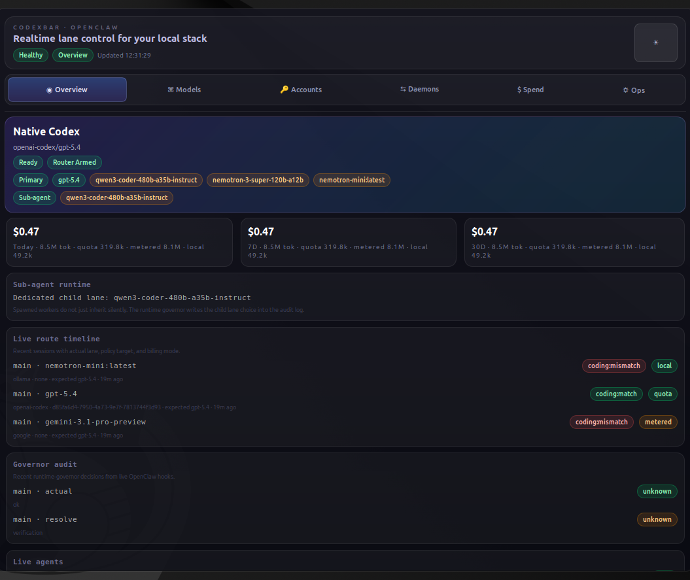
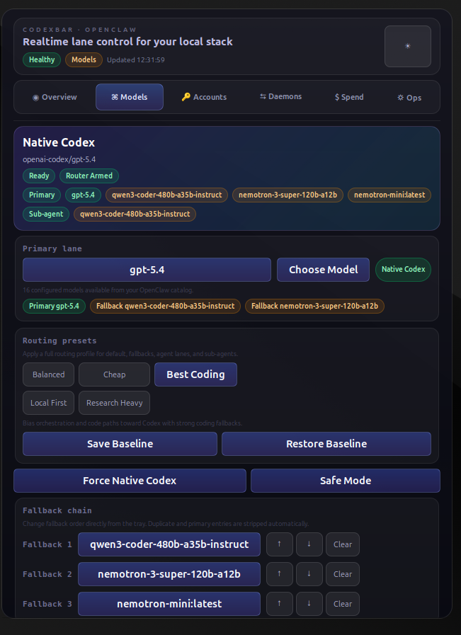
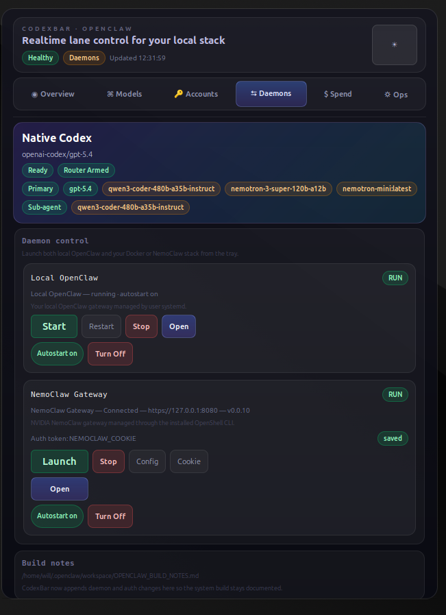
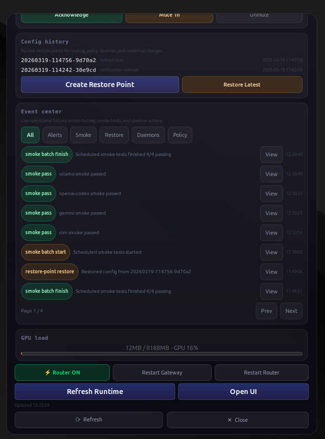

# CodeXbar Ubuntu Desktop

CodexBar is a GTK tray control surface for a local OpenClaw stack. This export includes:

- the `codexbar` desktop controller
- the `runtime-governor` OpenClaw plugin
- systemd user unit templates for the tray, scheduled smoke tests, and usage snapshots

## Screenshots

### Overview

The tray is built as a compact local control surface: routing, live status, spend, account state, daemons, and ops history in one popup.



### Models

Routing presets, primary lane selection, fallback chain management, and per-agent lane control live in the `Models` panel.



### Daemons

Local OpenClaw and NemoClaw can be launched, restarted, opened, and placed on autostart directly from the tray.



### Ops

The `Ops` view exposes scheduled smoke tests, restore points, alerts, and the event center for day-to-day runtime auditing.



## What Is Safe In This Repo

This repo is prepared to avoid publishing personal local state:

- no credentials
- no OpenClaw session history
- no Codex auth/session files
- no daemon cookies
- no runtime event logs
- no restore-point snapshots

Machine-specific paths were replaced with generic templates where needed.

## What You Still Must Not Commit

Do not add any of these local files:

- `~/.openclaw/credentials/env`
- `~/.openclaw/codexbar-state.json`
- `~/.openclaw/codexbar-daemons.json`
- `~/.openclaw/codexbar-events.jsonl`
- `~/.openclaw/runtime-governor-audit.jsonl`
- `~/.openclaw/restore-points/`
- `~/.codex/auth.json`
- `~/.codex/state_5.sqlite`

## Layout

- `codexbar/codexbar-linux.py`
- `runtime-governor/index.ts`
- `runtime-governor/openclaw.plugin.json`
- `runtime-governor/package.json`
- `systemd/`
- `docs/PUBLISHING.md`

## Install Notes

1. Copy `codexbar/codexbar-linux.py` to `~/.local/bin/codexbar-linux.py`
2. Copy the systemd units from `systemd/` to `~/.config/systemd/user/`
3. Copy `runtime-governor/` to your OpenClaw extensions directory
4. Reload user systemd:

```bash
systemctl --user daemon-reload
systemctl --user enable --now codexbar.service
systemctl --user enable --now codexbar-smoke-tests.timer
systemctl --user enable --now codexbar-usage-snapshot.timer
```

## GitHub

To publish:

```bash
cd ~/Documents/github/CodeXbar_UbuntuDesktop
git branch -M main
git add .
git commit -m "Initial sanitized CodeXbar export"
git remote add origin git@github.com:YOURNAME/CodeXbar_UbuntuDesktop.git
git push -u origin main
```
